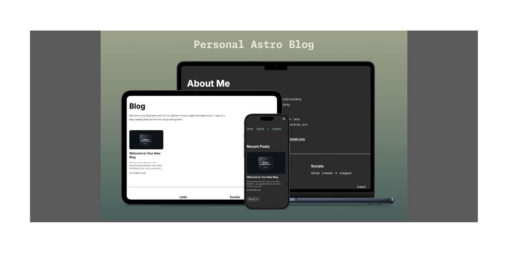

# Personal Blog Template

[](https://astro.build)
[](https://opensource.org/licenses/MIT)
[](https://github.com/aherendeen/personal-astro-blog/actions/workflows/ci.yml)

A minimal and professional theme for personal blog sites, built with the Astro framework and latest web technologies.



## Features

- **Fast Performance**: Built with Astro framework for optimized loading and performance
- **Modern Styling**: Tailwind CSS for responsive and maintainable design
- **Dark Mode Support**: Automatic dark/light mode with user preference detection
- **Responsive Design**: Mobile-first approach that works on all devices
- **Image Optimization**: Automatic image optimization during build process
- **Content Management**: MDX/Markdown support for rich content and component composition
- **SEO Optimization**: Built-in SEO features with proper meta tags and structured data
- **RSS Feed**: Automatic RSS feed generation for content syndication
- **Accessibility**: WCAG-conscious design with semantic HTML
- **TypeScript**: Full TypeScript support for better development experience
- **Automated Workflows**: GitHub Actions for linting, formatting, and type checking

## Technology Stack

- **Framework**: Astro 5.x (latest)
- **Styling**: Tailwind CSS 4.x (latest)
- **Language**: TypeScript 5.x
- **Content**: MDX for rich content
- **Icons**: Astro Icon with Iconify integration
- **Fonts**: Google Fonts (Inter, JetBrains Mono, Silkscreen)
- **Linting**: ESLint with Astro and TypeScript rules
- **Formatting**: Prettier with Astro plugin

## Quick Start

1. **Fork this repository** on GitHub
2. **Clone your fork** locally:
   ```bash
   git clone https://github.com/yourusername/your-repo.git
   cd your-repo
   ```
3. **Install dependencies**:
   ```bash
   npm install
   ```
4. **Start the development server**:
   ```bash
   npm run dev
   ```
5. **Customize your site**:
   - Update `src/consts.ts` with your personal information
   - Replace content in `src/content/blog/` with your posts
   - Update images in `public/` and `src/assets/`
   - Modify styles in `src/styles/global.css` if needed

## Configuration

### Site Settings

Edit `src/consts.ts` to customize:

- Site title and description
- Your name and bio
- Social media links
- Navigation menu items

### Environment Variables

Create a `.env` file (copy from `.env.example`):

```bash
# Site URL for production deployment
SITE_URL=https://yourdomain.com
```

### Deployment

- Ensure the `SITE_BASE` value in `src/consts.ts` is an empty string if you deploy to the root of a domain
- If you plan to host under a subpath, set `SITE_BASE` to that subpath (e.g. `/blog`)
- Update favicons & Open Graph images in `public/`
- Configure your deployment platform (Netlify, Vercel, Cloudflare Pages, etc.)

## Content Management

### Adding Blog Posts

1. Create a new `.md` or `.mdx` file in `src/content/blog/`
2. Use this frontmatter template:
   ```yaml
   ---
   title: 'Your Post Title'
   description: 'Brief description of your post'
   pubDate: 'Sep 16 2025'
   coverImageCredit: 'Photo by Author Name on Unsplash'
   ---
   ```
3. Write your content in Markdown or MDX
4. Add a cover image at `src/assets/blogimages/your-slug/cover.jpg` (recommended: 853x480px)
5. For images in content: ``

### Content Features

- **Reading Time**: Automatically calculated and displayed
- **Last Modified**: Automatically updated based on git history
- **Table of Contents**: Generated for posts with headings
- **Code Highlighting**: Syntax highlighting for code blocks
- **Responsive Images**: Automatic optimization and responsive sizing

## Development

### Available Scripts

```bash
# Development server
npm run dev

# Build for production
npm run build

# Preview production build
npm run preview

# Type checking
npm run typecheck

# Lint and format code
npm run lint
npm run format
```

### Project Structure

```
src/
├── components/          # Reusable UI components
├── content/
│   ├── blog/           # Blog posts
│   └── config.ts       # Content configuration
├── layouts/            # Page layouts
├── pages/              # Route pages
├── plugins/            # Custom remark/rehype plugins
├── styles/             # Global styles
└── consts.ts           # Site configuration
public/                 # Static assets
```

## Customization

### Styling

- **Global Styles**: Modify `src/styles/global.css`
- **Tailwind Config**: Customize `tailwind.config.js`
- **Component Styles**: Update individual component styles

### Components

- **Base Components**: Found in `src/components/`
- **Layout Components**: Customize page layouts in `src/layouts/`
- **Content Components**: Modify content rendering components

### Advanced Customization

- **Astro Config**: Modify `astro.config.mjs` for build customization
- **TypeScript**: Update `tsconfig.json` for type checking configuration
- **ESLint**: Customize linting rules in `eslint.config.js`

## Performance

This template is optimized for performance:

- **Static Generation**: Astro's static-first approach
- **Image Optimization**: Automatic image processing and optimization
- **CSS Optimization**: Tailwind CSS purging and minification
- **Font Optimization**: Self-hosted fonts with proper loading
- **Bundle Optimization**: Code splitting and tree shaking

## SEO & Social

- **Meta Tags**: Automatic meta tag generation
- **Open Graph**: Social media sharing optimization
- **Twitter Cards**: Twitter-specific meta tags
- **Structured Data**: JSON-LD for search engines
- **Sitemap**: Automatic sitemap generation
- **RSS Feed**: Content syndication support

## Contributing

This is a template repository. If you find issues or want to suggest improvements:

1. Fork the repository
2. Create a feature branch
3. Make your changes
4. Submit a pull request

## License

This project is open source and available under the [MIT License](LICENSE).

---

## Support

If you find this template helpful, you can support development:

- Buy me a coffee: https://www.buymeacoffee.com/aherendeen
- Sponsor on GitHub: https://github.com/sponsors/aherendeen
